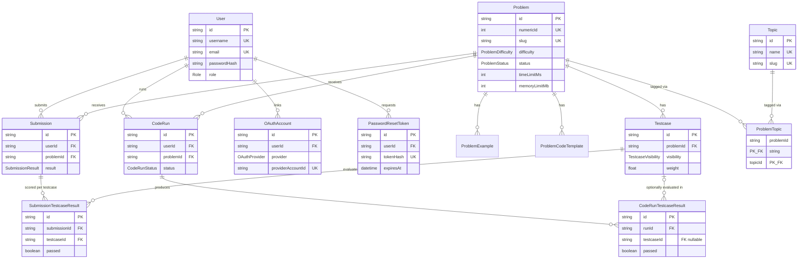
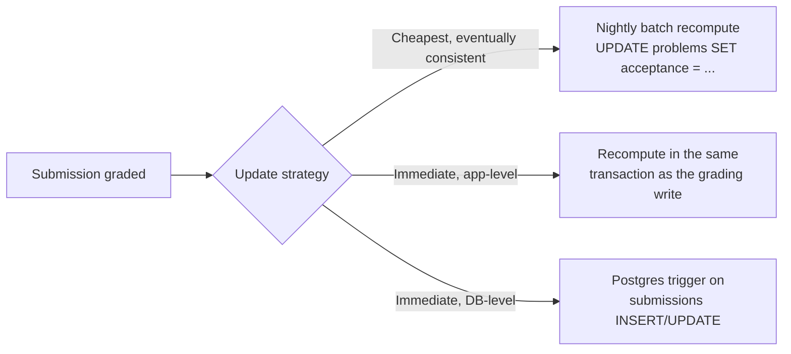

# Database Architecture

> Senior-level reference documentation for the Codenix data layer (PostgreSQL + Prisma). Generated from direct schema inspection — every claim below is traceable to a specific model, field, or constraint in `schema.prisma`.

---

## 1. Overview

The system is a competitive-programming / online-judge platform. The schema has four functional clusters:

| Cluster | Models | Responsibility |
|---|---|---|
| **Identity** | `User`, `OAuthAccount`, `PasswordResetToken` | Authentication, account linking, credential recovery |
| **Content** | `Problem`, `ProblemExample`, `ProblemCodeTemplate`, `Topic`, `ProblemTopic`, `Testcase` | Problem catalog and grading data |
| **Evaluation (graded)** | `Submission`, `SubmissionTestcaseResult` | Official, scored attempts |
| **Evaluation (ad hoc)** | `CodeRun`, `CodeRunTestcaseResult` | Scratch/"Run" executions, not graded |

The separation between `Submission` and `CodeRun` is a deliberate — and correct — design decision: it keeps low-stakes "try my code" executions out of the scoring/acceptance-rate pipeline instead of overloading a single table with a `type` discriminator.

---

## 2. Entity-Relationship Diagram



---

## 3. Model-by-Model Reference

### 3.1 `User`

**Purpose:** Canonical identity record; the root of the ownership graph for submissions and runs.

| Field | Notes |
|---|---|
| `id` | UUID PK — correct choice over serial ints for a public-facing identity table (non-enumerable). |
| `username`, `email` | Both `@unique` — enforced at the DB level, not just app level. Good. |
| `passwordHash` | Non-nullable `String`. **Gap:** a user who signs up purely via OAuth still needs *some* value here unless the field is made optional (see §7.1). |
| `role` | `Role` enum (`user`/`admin`), indexed. |
| `avatarUrl`, `degree`, `githubUrl`, `linkedinUrl` | Default `""` rather than nullable — see normalization note in §5.3. |

**Relationships:** 1:N to `Submission`, `CodeRun`, `OAuthAccount`, `PasswordResetToken`. All four are `onDelete: Cascade` from the child side, meaning **deleting a user deletes their entire submission and run history**. This is a product decision worth confirming explicitly (see §6).

**Indexes:** `@@index([role])` — supports admin-panel filtering by role. `username`/`email` uniques double as indexes for login lookups.

---

### 3.2 `Problem`

**Purpose:** The problem catalog entry — statement, constraints, grading parameters.

| Field | Notes |
|---|---|
| `id` (UUID) vs `numericId` (autoincrement) | Dual-key pattern: UUID for external/API references (non-guessable), `numericId` for human-friendly sequential display (e.g. "Problem #482"). This is a deliberate and good pattern, common in judge platforms (LeetCode-style numbering). |
| `slug` | Unique, used for URL routing. |
| `statement`, `inputFormat`, `outputFormat`, `constraints` | All `@db.Text` — correct, avoids `varchar` truncation risk for long problem statements. |
| `acceptance` | Denormalized `Float` — this is a **cached aggregate** (accepted / total submissions), not derived live. See §5.4 for the consistency risk this introduces. |
| `parameters` | `Json` — function-signature metadata for auto-graded languages. Appropriate use of JSON for a genuinely variable-shaped structure; not a normalization violation since parameter lists aren't relationally queried. |

**Indexes:** `status`, `difficulty`, composite `[status, difficulty]`, and `numericId`. The composite index directly supports the most common catalog query pattern (`WHERE status = 'published' AND difficulty = 'medium'`), and is a stronger signal of intentional design than the two single-column indexes alone — Postgres can usually satisfy single-column filters from a composite's leading column too, so the standalone `status` index is close to redundant with `[status, difficulty]` (kept only because it also serves `status`-only queries without a difficulty filter).

---

### 3.3 `ProblemExample`, `ProblemCodeTemplate`

Both are strict 1:N children of `Problem`, cascade-deleted, indexed on `problemId`.

- `ProblemCodeTemplate` has `@@unique([problemId, language])` — correctly prevents duplicate starter code for the same language on the same problem.
- `ProblemExample` has `orderIndex` for display ordering — appropriate since examples are inherently sequential (Example 1, 2, 3...) and that order isn't derivable from any other column.

---

### 3.4 `Topic` / `ProblemTopic`

Classic **many-to-many junction table**, correctly modeled:

- `ProblemTopic` has a **composite primary key** `@@id([problemId, topicId])` rather than a surrogate `id` — this is the right call for a pure join table with no attributes of its own; it also implicitly prevents duplicate tags on the same problem.
- `@@index([topicId])` supplements the PK, which already indexes `problemId` first — needed because Postgres can't use a composite PK's second column for an isolated `WHERE topicId = ?` lookup (e.g. "all problems tagged 'Graphs'").

---

### 3.5 `Testcase`

| Field | Notes |
|---|---|
| `visibility` | `sample` / `hidden` — controls whether a testcase's input/output is shown to the user pre-submission. |
| `weight` | Supports partial-credit scoring schemes. |
| `input`, `expectedOutput` | `@db.Text`. |

**Indexes:** `problemId`, and composite `[problemId, visibility]` — supports "give me the sample testcases for problem X" without a filter step in application code.

---

### 3.6 `Submission` / `SubmissionTestcaseResult`

The graded-attempt pipeline.

- `Submission.result` uses a closed `SubmissionResult` enum including `pending`, so a row exists the instant a submission is queued, before the judge has run — good for showing "Submission received" UI state without a separate status table.
- `SubmissionTestcaseResult` has `@@unique([submissionId, testcaseId])` — correctly prevents duplicate result rows if the judge callback is retried (idempotency at the DB level, not just application logic).
- Indexes on `Submission`: `userId`, `problemId`, `result`, `submittedAt`, plus composites `[userId, submittedAt]` and `[userId, problemId]`. This is a well-thought-out index set — it covers "user's submission history sorted by time," "user's attempts on a specific problem," and "all submissions with a given result" (useful for judge-queue monitoring) as distinct access patterns rather than hoping one index serves all of them.

---

### 3.7 `CodeRun` / `CodeRunTestcaseResult`

Structurally parallel to `Submission`/`SubmissionTestcaseResult`, but two differences are notable:

1. `CodeRunTestcaseResult.testcaseId` is **nullable** with `onDelete: SetNull` — because ad hoc runs can execute against **custom, user-provided input** that isn't tied to a stored `Testcase` row at all. This is correct: a hard FK here would force every "run with my own input" feature to fabricate a fake `Testcase` row, which would be a worse modeling compromise.
2. `CodeRun` carries `stdout`/`stderr` separately from `compileOutput`/`error`, while `Submission` does not. This asymmetry is reasonable — ad hoc runs are a debugging tool where raw stdout/stderr matters; graded submissions intentionally abstract that away into pass/fail + limited diagnostic text.

---

### 3.8 `OAuthAccount`

| Field | Notes |
|---|---|
| `provider` + `providerAccountId` | `@@unique([provider, providerAccountId])` — correctly prevents the same external account being linked twice, and correctly scopes uniqueness *per provider* (two different providers could theoretically issue the same raw ID string). |
| `email` (nullable) | Indexed. Used to support "does an account with this OAuth email already exist" account-linking logic. |

**Gap:** there is no unique constraint preventing the *same user* from linking the *same provider* twice under different provider account IDs (edge case, low severity — see §7.2).

---

### 3.9 `PasswordResetToken`

- `tokenHash` unique — tokens are stored hashed, not raw, which is correct (matches the security-hardening doc's requirement).
- `expiresAt` indexed — supports an efficient cleanup job (`DELETE FROM password_reset_tokens WHERE expires_at < now()`).
- `usedAt` nullable — enables single-use enforcement (`WHERE usedAt IS NULL`), though this should be enforced by checking `usedAt IS NULL AND expiresAt > now()` in the same transaction that consumes the token, not just at read time (race condition otherwise — see §7.3).

---

## 4. Cascade & Referential Integrity Rules

| Parent | Child | On Delete | Effect |
|---|---|---|---|
| `User` | `Submission` | Cascade | Deleting a user erases their submission history |
| `User` | `CodeRun` | Cascade | Deleting a user erases their run history |
| `User` | `OAuthAccount` | Cascade | Correct — orphaned OAuth links are meaningless |
| `User` | `PasswordResetToken` | Cascade | Correct |
| `Problem` | `ProblemExample`, `ProblemCodeTemplate`, `Testcase`, `ProblemTopic` | Cascade | Correct — these have no meaning without the parent problem |
| `Problem` | `Submission`, `CodeRun` | Cascade | **Deleting a problem erases all submission history for it** — see §6 |
| `Submission` | `SubmissionTestcaseResult` | Cascade | Correct |
| `CodeRun` | `CodeRunTestcaseResult` | Cascade | Correct |
| `Testcase` | `SubmissionTestcaseResult` | Cascade | Deleting a testcase erases historical per-testcase results tied to it |
| `Testcase` | `CodeRunTestcaseResult` | **SetNull** | Preserves the run's history, detaches it from the deleted testcase |

**The inconsistency to flag:** `Testcase → SubmissionTestcaseResult` cascades (destructive) while `Testcase → CodeRunTestcaseResult` uses `SetNull` (preserving). If historical grading integrity matters — e.g. for appeals, audits, or acceptance-rate recalculation — the graded path should arguably be the more conservative one, not the ad hoc path. Recommendation in §7.

---

## 5. Normalization Analysis

### 5.1 First Normal Form (1NF)

**Satisfied.** All columns hold atomic values with the single deliberate exception of `Problem.parameters` (`Json`), which is a justified exception — it stores a variable-arity, variable-typed function signature that is never filtered or joined on relationally. Storing it as JSON avoids a much worse alternative (a sparse `ProblemParameter` table with type-punned columns).

### 5.2 Second Normal Form (2NF)

**Satisfied.** No table has a composite primary key with a non-key attribute depending on only part of it. The one composite-key table, `ProblemTopic`, has no non-key attributes at all, so partial dependency is structurally impossible.

### 5.3 Third Normal Form (3NF) — minor violations

Two designed deviations worth naming explicitly rather than leaving implicit:

1. **`Problem.acceptance`** is a transitively derivable value (`COUNT(accepted submissions) / COUNT(total submissions)` from the `Submission` table). Storing it violates strict 3NF but is a standard, deliberate denormalization for read performance on a high-traffic catalog listing page. **This needs an explicit consistency strategy** — see §5.4.
2. **`User.avatarUrl`, `degree`, `githubUrl`, `linkedinUrl` defaulting to `""`** rather than being nullable isn't a normalization violation per se, but it does mean "no value provided" and "empty string provided" are indistinguishable at the schema level. For optional profile fields, nullable columns are the more precise representation and avoid every consumer having to treat `""` as a magic sentinel.

No other 3NF violations were found — every non-key attribute in every other table depends on the whole key and nothing but the key.

### 5.4 Consistency strategy for the denormalized `acceptance` field

Currently there is nothing in the schema enforcing that `Problem.acceptance` stays correct. Three standard approaches, in order of implementation cost:



Recommendation: **D** (transactional recompute at grading time) — it's immediate, doesn't require trigger maintenance in a Prisma-managed schema, and the write volume (one grading event) doesn't justify a nightly batch job's staleness window.

---

## 6. Design Decisions That Need an Explicit Product Answer

These aren't bugs — they're places where the schema encodes a policy decision that should be a conscious choice, not an accident of `onDelete: Cascade` being the path of least resistance:

1. **Should deleting a `User` really erase their entire submission history?** For a judge platform, submission history often has value beyond the individual user (aggregate stats, leaderboard integrity, plagiarism-detection corpus). Consider `onDelete: SetNull` on `Submission.userId` (making it nullable) with a separate "anonymized" display state, rather than hard deletion, if GDPR-style right-to-erasure can be satisfied by scrubbing PII instead of deleting rows.
2. **Should deleting a `Problem` erase historical submissions against it?** If a problem is ever retired/unpublished, existing submission records are likely still meaningful (user's personal history, past contest results). Consider soft-delete (`status = 'archived'`) for `Problem` instead of hard delete, sidestepping this cascade entirely.

---

## 7. Concrete Gaps & Recommendations

### 7.1 `User.passwordHash` should be nullable for OAuth-only accounts
As written, a user who registers exclusively through Google/GitHub OAuth still needs a non-null `passwordHash`, forcing either a fake/random hash (bad — implies a login path that shouldn't exist) or blocking pure-OAuth signup at the application layer with no schema-level guarantee. Make it `String?` and enforce "must have either a password or at least one OAuthAccount" at the application/service layer.

### 7.2 Add a uniqueness guard against duplicate provider links per user
```prisma
@@unique([userId, provider])
```
on `OAuthAccount`, preventing a single user from linking two different Google accounts (usually not desired) while still allowing multi-provider linking (Google + GitHub on the same user).

### 7.3 Enforce single-use password reset atomically
The check-then-use pattern (`SELECT ... WHERE usedAt IS NULL` followed by `UPDATE ... SET usedAt = now()`) is race-prone under concurrent requests with the same token. Use a single conditional update:
```sql
UPDATE password_reset_tokens
SET "usedAt" = now()
WHERE id = $1 AND "usedAt" IS NULL AND "expiresAt" > now()
RETURNING "userId";
```
Zero rows returned means "already used or expired" — atomically, without a separate read.

### 7.4 Reconcile the `Testcase` cascade asymmetry (§4)
Decide, as policy, whether graded historical results must survive testcase deletion. If yes, switch `SubmissionTestcaseResult.testcase` to the same `SetNull` pattern already used for `CodeRunTestcaseResult`.

### 7.5 Consider partitioning `Submission` and `CodeRun` by time
These are the highest-write-volume tables in the schema (one row per attempt, potentially per testcase). At scale, range-partitioning by `submittedAt`/`createdAt` (native Postgres declarative partitioning) keeps indexes smaller and makes retention/archival of old data a partition-drop instead of a slow `DELETE`. Not urgent at low volume, but worth deciding on before it becomes a migration under load.

### 7.6 Composite index redundancy check
Run `EXPLAIN ANALYZE` against real query patterns before assuming every listed index earns its write-amplification cost — in particular, confirm `Problem.@@index([status])` is still hit by query planner in cases `[status, difficulty]` doesn't already cover, since every additional index adds overhead to every `INSERT`/`UPDATE` on `problems`.

---

## 8. Query Pattern → Index Coverage Matrix

| Common query | Covering index | Covered? |
|---|---|---|
| Login by username or email | `username` / `email` unique | ✅ |
| List published problems by difficulty | `[status, difficulty]` | ✅ |
| User's submission history, newest first | `[userId, submittedAt]` | ✅ |
| User's attempts on one problem | `[userId, problemId]` | ✅ |
| Judge queue: all `pending` submissions | `[result]` | ✅ |
| Sample testcases for a problem | `[problemId, visibility]` | ✅ |
| Problems tagged with topic X | `ProblemTopic` PK + `[topicId]` | ✅ |
| Cleanup expired reset tokens | `[expiresAt]` | ✅ |
| **User's `CodeRun` history, newest first** | *none* — only `userId`, `problemId`, `status` exist individually | ⚠️ Missing `[userId, createdAt]` composite, mirroring `Submission`'s pattern |
| **Admin: submissions in a date range across all users** | `submittedAt` alone (not composite) | ⚠️ Usable but not ideal at scale; fine for now |

---

## 9. Summary of Action Items

| Priority | Item | Type |
|---|---|---|
| High | Make `passwordHash` nullable; enforce auth-method invariant at app layer | Schema change |
| High | Atomic conditional update for password reset consumption | Application code |
| Medium | Add `[userId, createdAt]` index to `CodeRun` | Schema change |
| Medium | Add `[userId, provider]` unique constraint to `OAuthAccount` | Schema change |
| Medium | Decide and document cascade policy for `Testcase → SubmissionTestcaseResult` | Product decision |
| Medium | Move `acceptance` recompute into the grading transaction | Application code |
| Low | Change optional profile fields (`avatarUrl`, `degree`, etc.) to nullable | Schema change |
| Low | Evaluate soft-delete for `Problem` and `User` instead of hard cascade | Product decision |
| Low | Plan time-based partitioning for `Submission`/`CodeRun` ahead of scale | Infrastructure |