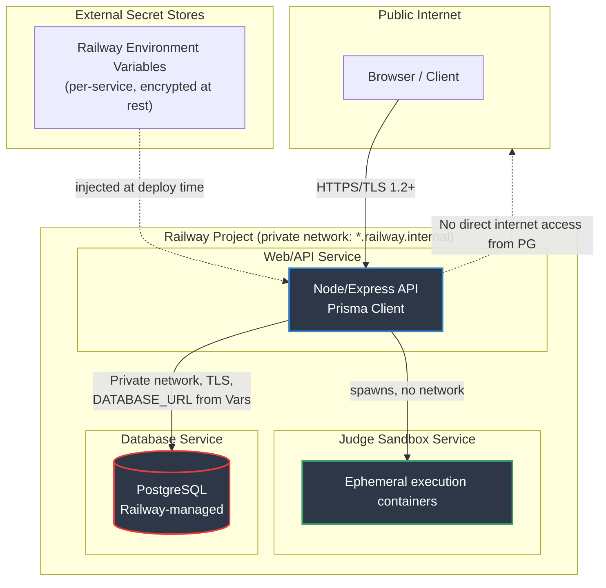

# 05-security-hardening.md

# Security Hardening

> This document describes the current security posture of Codenix, with concrete, environment-specific controls — particularly for the PostgreSQL database deployed on Railway. Each control below is marked **[IMPLEMENTED]**, **[CONFIG — action required]**, or **[ROADMAP]** so nothing is presented as done when it isn't.

---

## 1. Architecture & Trust Boundaries



**Key boundary decisions:**
- The database must never be reachable from the public internet — only from services on the same Railway private network.
- The judge sandbox is network-isolated from both the internet and the database (see §8).
- Secrets flow one way: Railway Variables → runtime environment. They are never written to disk, logs, or Git.

---

## 2. Database Hardening (Railway + PostgreSQL + Prisma)

This is the section most often left vague ("use parameterized queries" and nothing else). Below is what actually needs to be configured, and where.

### 2.1 Network exposure — [CONFIG — action required]

- **Disable the public TCP proxy** for the Postgres service unless a specific external tool (e.g. a BI dashboard) genuinely requires it. In Railway: Database service → Settings → Networking → remove/do not generate a public domain/TCP proxy.
- If external access is unavoidable (e.g. local dev against prod-like data), restrict it to the Railway **TCP Proxy** with a strong, rotated password, and prefer `railway connect` / `railway run` over exposing a permanent public endpoint.
- Application services must connect via the **private network hostname** (`*.railway.internal`) and the internal `DATABASE_URL`, not the public proxy URL. This traffic never leaves Railway's internal network.

### 2.2 Transport encryption — [CONFIG — action required]

- Enforce `sslmode=require` (or `verify-full` if you manage certs) in the Prisma `DATABASE_URL`, even on the private network — Railway's internal network is trusted but not a substitute for encryption in transit if the project ever adds untrusted services.
- Reject Prisma connections that fall back to `sslmode=disable`.

### 2.3 Least-privilege roles — [CONFIG — action required]

Railway provisions a single superuser-like role by default. That role should **not** be the one your app uses day-to-day:

```sql
-- Run once, as the Railway-provided admin role
CREATE ROLE codenix_app LOGIN PASSWORD '<generated>';
GRANT CONNECT ON DATABASE railway TO codenix_app;
GRANT USAGE ON SCHEMA public TO codenix_app;
GRANT SELECT, INSERT, UPDATE, DELETE ON ALL TABLES IN SCHEMA public TO codenix_app;
GRANT USAGE, SELECT ON ALL SEQUENCES IN SCHEMA public TO codenix_app;

-- Ensure future tables inherit the same grants
ALTER DEFAULT PRIVILEGES IN SCHEMA public
  GRANT SELECT, INSERT, UPDATE, DELETE ON TABLES TO codenix_app;
```

- Use `codenix_app` for the running application's `DATABASE_URL`.
- Reserve the admin/owner role **only** for `prisma migrate deploy` in CI/CD, via a separate `MIGRATE_DATABASE_URL` secret not present in the running app container.
- No role used by the app should have `CREATEDB`, `CREATEROLE`, or `SUPERUSER`.

### 2.4 Migrations — [CONFIG — action required]

- Run `prisma migrate deploy` (not `migrate dev`) in the deploy pipeline, using the elevated migration role, then swap back to `codenix_app` for runtime.
- Never run `prisma db push` against production — it can silently drop columns/tables without a reviewable migration file.
- Require migration SQL files to be reviewed in PRs; Prisma's generated SQL is not automatically safe for destructive changes (column drops, type narrowing).

### 2.5 Connection handling — [CONFIG — action required]

- Set a bounded Prisma connection pool (`connection_limit` in `DATABASE_URL`, or an external pooler like PgBouncer/Railway's built-in pooling if enabled) to avoid exhausting Postgres `max_connections` under load — this is both a reliability and a DoS-resilience control.
- Set `statement_timeout` and `idle_in_transaction_session_timeout` at the role level so a hung query or leaked transaction cannot lock rows indefinitely:

```sql
ALTER ROLE codenix_app SET statement_timeout = '15s';
ALTER ROLE codenix_app SET idle_in_transaction_session_timeout = '30s';
```

### 2.6 Backups & recovery — [CONFIG — action required]

- Confirm Railway's automatic volume backups are enabled for the Postgres plan in use, and note the retention window — this varies by plan and is not automatic on all tiers.
- Additionally schedule an independent `pg_dump` to encrypted object storage (e.g. daily, via a Railway cron service) so recovery does not depend solely on the platform's snapshot mechanism.
- Periodically test restoring a backup into a scratch environment. An untested backup is not a control, it's a hope.

### 2.7 Data-at-rest & sensitive columns — [ROADMAP]

- Volume-level encryption at rest depends on Railway's underlying infrastructure provider; verify current guarantees directly with Railway before stating this as a control.
- For specifically sensitive columns (e.g. OAuth refresh tokens, if ever stored), consider application-level encryption (e.g. AES-GCM with a key from env vars) in addition to transport/volume encryption, rather than relying on database-level encryption alone.

### 2.8 Auditing — [ROADMAP]

- Enable `pgAudit` or, at minimum, log DDL and role/privilege changes (`log_statement = 'ddl'`) so schema and permission changes are traceable.
- Ship Postgres logs off-platform (e.g. to a log sink) since Railway's log retention is limited.

### 2.9 Injection surface — [IMPLEMENTED]

- Prisma's generated client parameterizes all standard query and mutation calls, mitigating classic SQL injection for normal usage.
- **Caveat, not covered by the above:** any use of `$queryRawUnsafe`, `$executeRawUnsafe`, or raw string interpolation into `$queryRaw` templates bypasses this protection. These must be grep-searched for in CI (`rg '\$queryRawUnsafe|\$executeRawUnsafe'`) and require explicit justification in review.

---

## 3. Authentication

- **[IMPLEMENTED]** Passwords are stored as hashes, never plaintext.
- **[IMPLEMENTED]** OAuth accounts are linked through dedicated identity records rather than merged into the password table.
- **[ROADMAP]** JWT access tokens should be short-lived (5–15 min) with rotating, single-use refresh tokens stored server-side (or as hashed values) so a stolen refresh token can be revoked.

## 4. Authorization

- **[ROADMAP]** Role-based authorization enforced centrally (middleware/guard) at every API boundary, not per-handler ad hoc checks.
- **[ROADMAP]** Administrative endpoints require an explicit role check plus, ideally, re-authentication for high-risk actions (role changes, data export).

## 5. Password Storage

- **[CONFIG — action required]** Standardize on Argon2id with tuned memory/time cost (current bcrypt usage, if any, should be migrated opportunistically on next login).
- **[IMPLEMENTED]** Credentials are never logged.
- **[ROADMAP]** Password reset tokens stored as hashes, single-use, short expiry (≤ 1 hour).

## 6. Input Validation

- **[ROADMAP]** Schema validation (e.g. Zod) at every route boundary before business logic executes.
- **[ROADMAP]** Reject unknown fields (`strict()` schemas) to prevent mass-assignment style bugs.
- **[ROADMAP]** Normalize/sanitize free-text input that is later rendered or exported.

## 7. Secrets

- **[IMPLEMENTED]** Secrets live only in Railway Environment Variables, scoped per service (API service and DB migration role should have *different* variable sets — don't give the runtime app the migration-capable connection string).
- **[IMPLEMENTED]** `.env` files are git-ignored; no secrets committed.
- **[ROADMAP]** Rotate `DATABASE_URL` credentials and JWT signing keys on a fixed schedule (e.g. quarterly) and immediately on suspected leak, using Railway's variable versioning to avoid downtime during rotation.

## 8. Judge Sandbox

- **[IMPLEMENTED]** Execution containers run without `--privileged`.
- **[IMPLEMENTED]** Linux capabilities dropped (`--cap-drop=ALL`, add back only what's strictly needed).
- **[IMPLEMENTED]** `--security-opt=no-new-privileges` set.
- **[IMPLEMENTED]** Networking disabled for execution containers (`--network=none`) — this also means the sandbox has no path to the database, satisfying the isolation shown in §1's diagram.
- **[IMPLEMENTED]** Temp filesystem mounted read-only where possible; writable scratch space is a size-capped tmpfs.
- **[IMPLEMENTED]** Temporary directories cleaned after execution.
- **[ROADMAP]** Per-container CPU/memory/pids-limits enforced (`--memory`, `--pids-limit`) to prevent fork-bomb / resource-exhaustion from submitted code.

## 9. HTTP Security

- **[ROADMAP]** Helmet (or equivalent headers) enabled.
- **[ROADMAP]** Strict CORS allow-list (explicit origins, not `*`, especially since credentials/cookies are involved).
- **[ROADMAP]** Rate limiting, tuned tighter on auth endpoints than general API endpoints.
- **[ROADMAP]** Secure, `HttpOnly`, `SameSite=Strict/Lax` cookies where cookies are used.

## 10. Logging

- **[IMPLEMENTED]** Passwords, JWTs, and OAuth tokens excluded from logs.
- **[ROADMAP]** Centralized audit log for privileged actions (role changes, admin logins, data exports, migration runs) — see §2.8 for the database-side piece of this.

---

## 11. Remaining Risks

| Risk | Recommendation | Status |
|------|----------------|--------|
| Database exposed via public Railway proxy | Disable public TCP proxy; private network only | CONFIG — action required |
| App using superuser DB role | Create scoped `codenix_app` role; reserve admin role for migrations only | CONFIG — action required |
| Unbounded/hung DB connections | Set `statement_timeout`, pool `connection_limit` | CONFIG — action required |
| Backup restore untested | Scheduled `pg_dump` + periodic restore drill | CONFIG — action required |
| Raw SQL bypassing Prisma parameterization | CI grep for `$queryRawUnsafe`/`$executeRawUnsafe`; review gate | ROADMAP |
| Token theft | Refresh-token rotation, server-side revocation list | ROADMAP |
| Brute force | Progressive rate limiting on auth routes | ROADMAP |
| Container escape (judge sandbox) | Keep Docker/base image updated, AppArmor/seccomp profile | ROADMAP |
| Dependency vulnerabilities | Automated dependency scanning (Dependabot/Snyk) | ROADMAP |
| Schema drift from ad hoc `db push` | Enforce `migrate deploy` only in CI/CD, block direct prod pushes | CONFIG — action required |

---

## 12. Prioritized Hardening Roadmap

Ordered by risk reduction per unit of effort, not just topic grouping:

1. **Disable the public Postgres proxy on Railway; confirm app connects only via private network + `sslmode=require`.**
2. **Create the least-privilege `codenix_app` role; remove runtime use of the admin/superuser role.**
3. Set `statement_timeout` / `idle_in_transaction_session_timeout` and a bounded Prisma connection pool.
4. Lock down `prisma migrate deploy` to CI/CD only; block `db push` against production.
5. Independent scheduled `pg_dump` backup + one documented restore drill.
6. Argon2id everywhere for password hashing.
7. Refresh token rotation with server-side revocation.
8. CSP and remaining security headers (Helmet), strict CORS allow-list.
9. GitHub secret scanning + CI grep-gate for raw SQL functions.
10. SAST + Dependabot.
11. Automated container image scanning for the judge sandbox base image.
12. Centralized audit logging (app-level + Postgres DDL/role logging).
13. Application-level encryption for any sensitive columns beyond hashed passwords.
14. Periodic penetration testing.

---

## 13. Verification Checklist (for whoever implements this)

- [ ] Postgres service on Railway has **no public domain/TCP proxy**, or it's protected and justified
- [ ] `DATABASE_URL` used by the running app points to `*.railway.internal`, uses `codenix_app`, and includes `sslmode=require`
- [ ] `codenix_app` role has no `SUPERUSER`/`CREATEDB`/`CREATEROLE`
- [ ] A separate migration-only connection string exists and is **not** in the runtime service's variables
- [ ] `statement_timeout` and `idle_in_transaction_session_timeout` set on `codenix_app`
- [ ] Prisma connection pool size is bounded and consistent with Postgres `max_connections`
- [ ] A backup job runs independently of Railway's platform snapshots
- [ ] At least one restore has been tested end-to-end in a non-prod environment
- [ ] `rg '\$queryRawUnsafe|\$executeRawUnsafe'` returns zero unreviewed hits