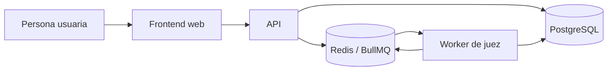

# Arquitectura

## Objetivo

Codenix separa la experiencia de práctica, la API transaccional y la ejecución de código no confiable. Esta separación permite escalar cada responsabilidad y, sobre todo, evita que el plano de ejecución tenga acceso directo a datos de producto.

## Componentes

| Componente | Responsabilidad | No es responsable de |
| --- | --- | --- |
| Frontend | Navegación, autenticación de la sesión de usuario, edición y visualización de resultados. | Ejecutar ni validar código no confiable. |
| API | Reglas de negocio, autorización, persistencia, creación de ejecuciones y publicación de trabajos. | Compilar o ejecutar soluciones en el proceso web. |
| PostgreSQL | Fuente de verdad para usuarios, problemas, ejecuciones, envíos y resultados. | Coordinar trabajos o exponer datos al navegador directamente. |
| Redis / BullMQ | Transporte y coordinación de trabajos de evaluación. | Conservar el historial funcional de un envío. |
| Worker de juez | Consume trabajos, crea el sandbox, evalúa casos y persiste el veredicto. | Atender tráfico HTTP público. |

## Flujos principales

### Ejecución de prueba

1. La persona envía código y casos de muestra o entradas personalizadas a la API.
2. La API valida la solicitud, crea un `CodeRun` con estado `pending` y publica un trabajo identificado por ese registro.
3. El worker cambia el estado a `running`, ejecuta cada caso de prueba y persiste resultados y métricas.
4. El cliente consulta el resultado mediante la API.

### Envío evaluado

El flujo es equivalente, pero la API crea un `Submission`. El worker usa los casos de prueba autorizados para evaluación y registra un veredicto final junto con los resultados por caso.

## Límites de confianza

- El navegador solo se comunica con el frontend y la API por HTTPS.
- PostgreSQL y Redis no son servicios públicos; solo aceptan conexiones desde servicios autorizados.
- El worker se ejecuta en una instancia aislada y no recibe peticiones del navegador.
- Los contenedores creados por el worker no tienen red y reciben límites de CPU, memoria, procesos, archivos y salida.

La topología de despliegue y sus requisitos de red se detallan en [despliegue](deployment.md); las decisiones se registran en los [ADRs](decisions/README.md).
