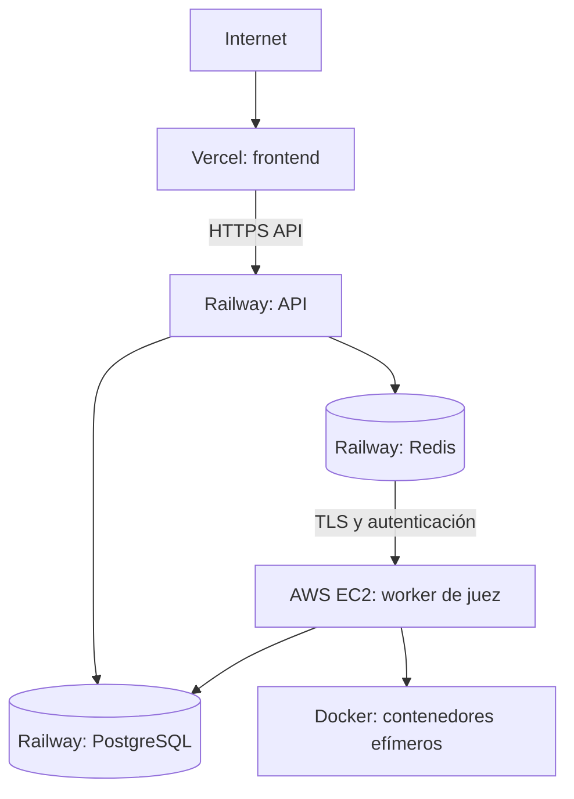

# Despliegue

## Topología de producción



| Plataforma | Servicio | Responsabilidad |
| --- | --- | --- |
| Vercel | Frontend | Entrega de la aplicación web y recursos estáticos. |
| Railway | API | API HTTP, autenticación, reglas de negocio y productor de trabajos. |
| Railway | PostgreSQL | Persistencia transaccional y migraciones Prisma. |
| Railway | Redis | Cola BullMQ entre la API y el worker. |
| AWS EC2 | Worker de juez | Consumo de trabajos y ejecución aislada de soluciones. |

La instancia del worker se aprovisiona con [CloudFormation](../infrastructure/cloudformation/judge-worker-ec2.yml). La plantilla instala el host, recupera la configuración desde Secrets Manager, clona el repositorio, instala dependencias del worker, precarga las imágenes Docker requeridas y arranca únicamente `codenix-judge-worker.service`.

## Reglas operativas

- El frontend solo conoce la URL pública de la API; las credenciales nunca se incorporan al bundle.
- PostgreSQL no debe exponer un proxy público. La API se conecta mediante la red privada de Railway.
- Redis debe requerir autenticación, cifrado en tránsito y acceso de red limitado a la API y a la instancia EC2.
- La instancia EC2 debe permitir únicamente tráfico saliente indispensable hacia Redis y PostgreSQL, y acceso administrativo restringido. No expone el worker al público.
- El worker necesita Docker y las imágenes de ejecución previamente disponibles. Las actualizaciones de imágenes se realizan mediante un proceso de despliegue controlado, nunca como descarga durante una evaluación.

## Aprovisionamiento del worker EC2

La plantilla recibe una subred privada, un grupo de seguridad sin reglas de entrada, la URL HTTPS de un repositorio público, la rama y el ARN de un secreto de AWS Secrets Manager. El secreto debe ser JSON e incluir como mínimo `DATABASE_URL`, `REDIS_URL` y `JWT_ACCESS_SECRET`; sus valores no se pasan como parámetros ni se escriben en CloudFormation.

Antes de crear el stack, confirme que la subred tiene salida controlada para instalar paquetes, clonar el repositorio, obtener imágenes Docker y conectarse a Railway. Para un repositorio privado, use una estrategia de autenticación de Git gestionada fuera de la URL del repositorio antes de desplegar.

```bash
aws cloudformation deploy \
  --stack-name codenix-judge-worker \
  --template-file infrastructure/cloudformation/judge-worker-ec2.yml \
  --capabilities CAPABILITY_NAMED_IAM \
  --parameter-overrides \
    VpcId=vpc-... \
    SubnetId=subnet-... \
    WorkerSecurityGroupId=sg-... \
    RepositoryUrl=https://github.com/organizacion/codenix.git \
    RepositoryBranch=main \
    WorkerSecretArn=arn:aws:secretsmanager:REGION:ACCOUNT_ID:secret:codenix/worker-...
```

## Variables de entorno

Cada servicio recibe sus variables desde el gestor de secretos de su plataforma. No se versionan archivos `.env` con valores reales.

| Servicio | Variables principales |
| --- | --- |
| Frontend | URL pública de la API y URL del sitio. |
| API | `DATABASE_URL`, `REDIS_URL`, secretos JWT, URL del frontend y credenciales OAuth. |
| Worker | `DATABASE_URL`, `REDIS_URL` y configuración del modo de juez. |

Las URLs de Redis y PostgreSQL que consume EC2 deben ser privadas o estar protegidas por una conectividad privada equivalente. Si Railway no ofrece conectividad privada directa con EC2, se debe establecer un canal cifrado y restringido antes de habilitar el worker en producción.

## Despliegue seguro

1. Ejecutar migraciones de base de datos de forma controlada y compatible hacia adelante.
2. Desplegar la API y verificar `/api/health`.
3. Desplegar o reiniciar el worker y verificar que consume un trabajo de prueba no productivo.
4. Desplegar el frontend con la URL de API correspondiente.
5. Revisar logs, fallos de trabajos y métricas de Redis tras el cambio.

Los controles complementarios están en [seguridad](security.md).
