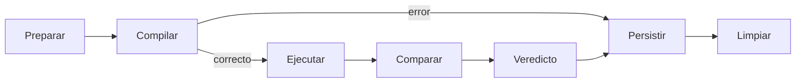

# J-002: Pipeline de ejecución

**Estado:** Propuesto

## Decisión

La evolución del juez seguirá un pipeline determinista: preparar, compilar, ejecutar, comparar, decidir veredicto, persistir y limpiar. Cada etapa recibe el mismo contexto de ejecución y solo modifica el estado de su responsabilidad.

## Reglas

- La compilación ocurre una sola vez y antes del primer caso.
- Los casos de prueba se ejecutan de manera independiente.
- Solo persistencia escribe en PostgreSQL.
- La limpieza se ejecuta incluso ante fallo, cancelación o excepción.
- El worker delega el flujo al motor y no calcula veredictos.

## Criterios de aceptación

- El flujo es visible y comprobable con pruebas por etapa.
- Un fallo de compilación omite ejecución y comparación.
- Ninguna etapa omite la limpieza.
