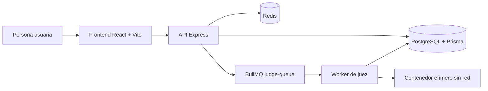

# Diseño actual del sistema

> Estado: implementado con áreas evolutivas documentadas en las especificaciones.  
> Última revisión: 14 de septiembre de 2026.

## Contexto y objetivo

Codenix permite practicar problemas de algoritmos desde el navegador. La persona usuaria elige un problema, escribe únicamente la función que debe resolverlo, ejecuta casos de prueba o envía una solución y consulta un veredicto con sus métricas. El servidor prepara los adaptadores, serializa los casos y ejecuta el código en un entorno aislado.

El diseño separa el tráfico web de la ejecución de código no confiable. PostgreSQL conserva la fuente de verdad; Redis y BullMQ coordinan trabajos y aceleran lecturas repetidas.

## Requisitos del sistema

### Funcionales

- Autenticar personas mediante correo y proveedores OAuth.
- Explorar problemas por tema, dificultad, búsqueda y progreso.
- Mostrar plantillas específicas por problema y lenguaje, sin exigir JSON a la persona usuaria.
- Ejecutar casos de prueba y enviar soluciones de forma asíncrona.
- Mostrar estado, veredicto, resultados por caso, tiempo y memoria.
- Mantener envíos, progreso, perfiles y actividad.
- Permitir comentarios, respuestas anidadas, votos y reputación por problema.
- Administrar problemas, casos, plantillas y recursos gráficos con permisos de administrador.

### No funcionales

- Validar entradas y permisos en el borde de la API.
- Mantener la ejecución fuera del proceso HTTP y limitar su consumo.
- Evitar que Redis sea una fuente de verdad.
- Mantener compatibilidad hacia adelante durante migraciones.
- Exponer estados de carga, error y vacío de forma comprensible en el frontend.

## Componentes y responsabilidades

| Componente | Responsabilidad | Límite explícito |
| --- | --- | --- |
| Frontend | Navegación, sesión, editor, resultados y accesibilidad. | No ejecuta código ni decide permisos. |
| API | Autenticación, autorización, validación, persistencia y coordinación. | No compila ni ejecuta soluciones en el proceso web. |
| PostgreSQL | Usuarios, problemas, plantillas, casos, ejecuciones, envíos y comunidad. | No coordina trabajos ni se expone al navegador. |
| Redis/BullMQ | Cola, cache de lecturas y deduplicación temporal. | No reemplaza registros de dominio. |
| Worker | Consume trabajos, construye el adaptador y persiste resultados. | No atiende tráfico HTTP público. |

## Flujo de una solución

1. El frontend envía el código de la función junto con el identificador del problema y el lenguaje.
2. La API valida el token, el límite de tamaño y el lenguaje permitido; crea un `CodeRun` o `Submission` en estado `pending`.
3. El trabajo se publica en `judge-queue` con un identificador idempotente.
4. El worker carga la plantilla y los casos autorizados, genera el wrapper del lenguaje y ejecuta en un contenedor efímero.
5. Cada caso produce estado, salida normalizada, tiempo y memoria; el envío termina con un veredicto agregado.
6. El frontend consulta el recurso con una cadencia acotada hasta recibir un estado final.

## Contratos y persistencia

- Las rutas HTTP se sirven bajo `/api` y usan `Authorization: Bearer <token>` cuando son protegidas.
- Los estados de evaluación son `pending`, `running`, `accepted`, `wrong_answer`, `runtime_error`, `time_limit_exceeded`, `memory_limit_exceeded`, `compilation_error` e `internal_error`.
- PostgreSQL es la fuente de verdad para el historial. Redis usa TTL y se invalida cuando una mutación puede dejar una lectura obsoleta.
- Las plantillas son específicas por problema y lenguaje. La función pública se deriva del *slug*; el adaptador del servidor maneja serialización y casos.

## Seguridad y operación

La API aplica Helmet, CORS explícito, validación con esquemas, límites de tasa y manejo centralizado de errores. El worker ejecuta con usuario no privilegiado, sin red, sistema de archivos limitado, capacidades eliminadas y límites de CPU, memoria, procesos, descriptores, tiempo y salida.

Producción separa frontend, API, PostgreSQL, Redis y worker. Las migraciones se ejecutan como paso controlado antes de activar una versión compatible de la API. Los detalles están en [despliegue](deployment.md) y [seguridad](security.md).

## Trade-offs aceptados

- **Cola asíncrona:** añade latencia observable, pero evita bloquear la API y permite controlar la capacidad del juez.
- **PostgreSQL como fuente de verdad:** simplifica consistencia y auditoría; Redis queda como optimización descartable.
- **Plantillas por problema:** mejora la experiencia y reduce errores de entrada, a cambio de mantener sincronizados lenguaje, función y adaptador.
- **Worker aislado:** requiere infraestructura adicional, pero reduce el impacto de ejecutar código no confiable.

Las decisiones transversales se registran en los [ADRs](decisions/README.md) y los requisitos detallados en [especificaciones](specifications/README.md).
